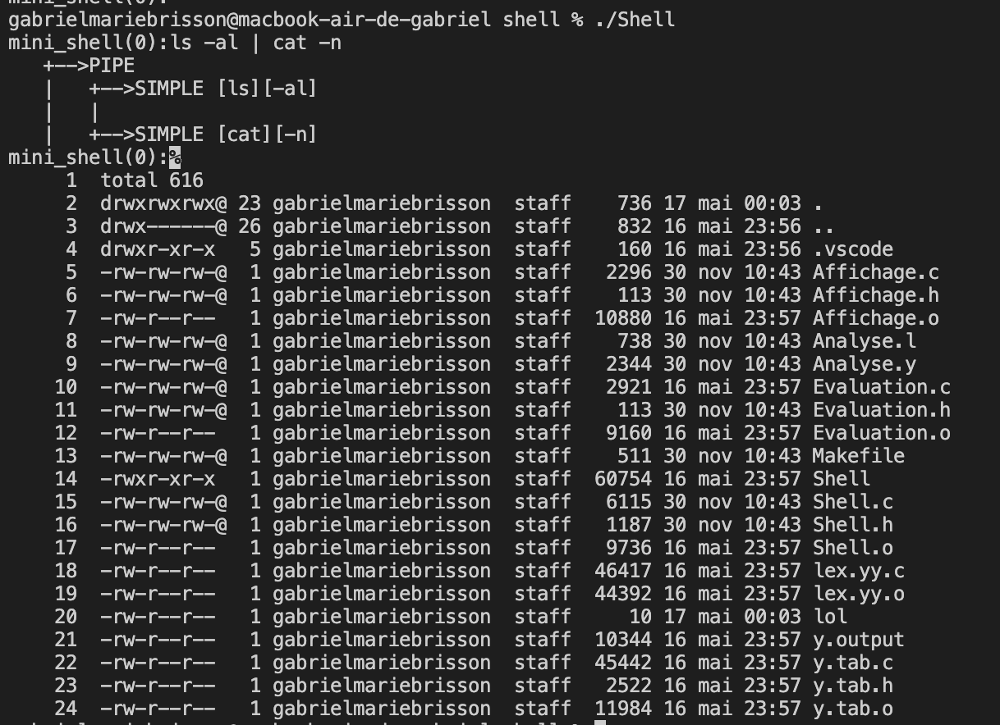

## Programmation Système - Programmation d'un Interprète Shell

Ce projet vise à développer un interprète de commandes shell en implémentant différentes fonctionnalités. L'embryon de shell fourni dans le répertoire "fork-exec" est capable d'analyser les lignes de commande et d'afficher le résultat de cette analyse. Le programme utilise une fonction d'analyse syntaxique qui renvoie un arbre syntaxique représentant la structure des commandes.

## Instructions

1. Compilez le programme en utilisant la commande `gcc -o Shell Shell.c`.
2. Testez le programme en exécutant `./Shell`. Consultez la fonction `afficher_expr()` pour comprendre comment la structure de données associée à une expression est explorée de manière récursive.
   - Remarque : La fonction `afficher_expr()` renvoie NULL en cas de ligne syntaxiquement incorrecte.

## Mini-projet

Objectifs et plan de travail :

1. **Exécution et redirection de commandes simples** :
   - Exécutez une commande externe simple (par exemple, `ls -al`).
   - Effectuez une redirection de la sortie standard (par exemple, `ls -al > output`) ou de l'entrée standard (par exemple, `cat -n < output`).
   - Effectuez des redirections simultanées de la sortie standard et de l'entrée standard (par exemple, `cat -n < input > output`).
   - Mettez en place toutes les redirections vers des fichiers.

2. **Enchaînement de commandes et utilisation de pipelines** :
   - Évaluez une séquence de commandes (par exemple, `ls -al ; cat -n lol`) en utilisant les opérateurs `&&` et `||`.
   - Évaluez des pipelines de deux commandes (par exemple, `ls -al | cat -n`).
   - Évaluez des pipelines de plusieurs commandes.

3. **Traitement des commandes en arrière-plan** :
   - Mettez une commande en arrière-plan (par exemple, `xeyes &`).
   - Mettez en place l'élimination des processus zombies en utilisant le traitement des signaux.

## Images

 